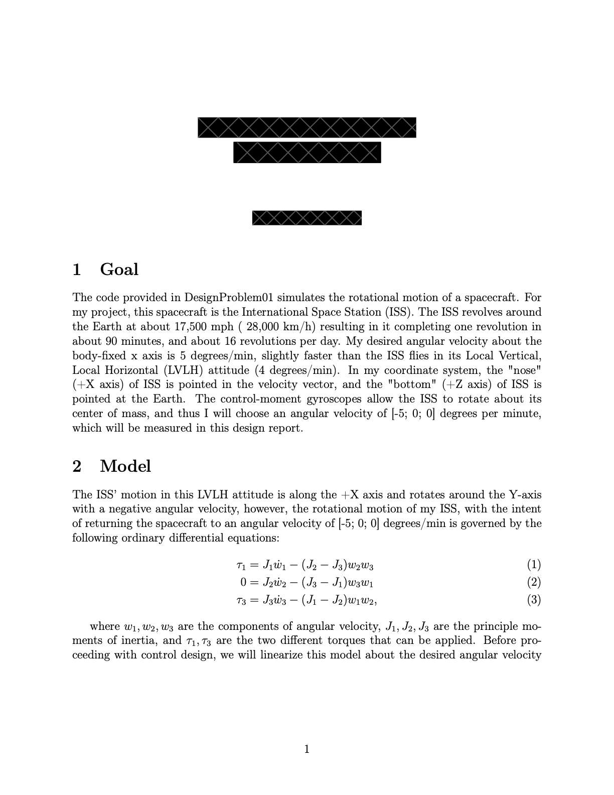
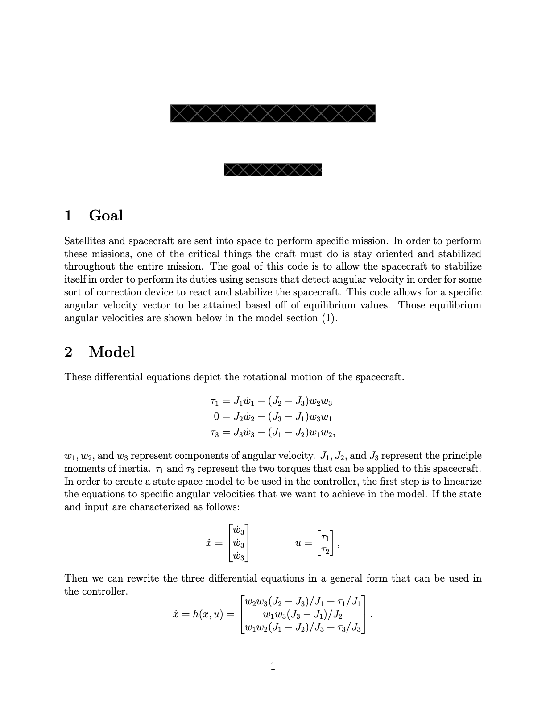

## Contents
{:.no_toc}

* This text will be replaced by a table of contents (excluding the above header) as an unordered list
{:toc}

---

# Homework

* [HW1](https://www.prairielearn.org/pl/course_instance/129078/assessment/2316731)
* [HW2](https://www.prairielearn.org/pl/course_instance/129078/assessment/2316751)
* [HW3](https://www.prairielearn.org/pl/course_instance/129078/assessment/2316827)
* [HW6](https://www.prairielearn.org/pl/course_instance/129078/assessment/2317020)
* [HW7](https://www.prairielearn.org/pl/course_instance/129078/assessment/2317073)
* [HW8](https://www.prairielearn.org/pl/course_instance/129078/assessment/2317106)
* [HW12](https://www.prairielearn.org/pl/course_instance/129078/assessment/2317506)
* [HW13](https://www.prairielearn.org/pl/course_instance/129078/assessment/2317548)
* [HW14](https://www.prairielearn.org/pl/course_instance/129078/assessment/2317606)
* [HW15](https://www.prairielearn.org/pl/course_instance/129078/assessment/2317630)
* [HW17](https://www.prairielearn.org/pl/course_instance/129078/assessment/2317709)
* [HW20](https://www.prairielearn.org/pl/course_instance/129078/assessment/2317860)
* [HW21](https://www.prairielearn.org/pl/course_instance/129078/assessment/2317891)
* [HW22](https://www.prairielearn.org/pl/course_instance/129078/assessment/2318052)
* [HW23](https://www.prairielearn.org/pl/course_instance/129078/assessment/2318085)
* [HW24](https://www.prairielearn.org/pl/course_instance/129078/assessment/2318114)
* [HW33](https://www.prairielearn.org/pl/course_instance/129078/assessment/2318452)
* [HW34](https://www.prairielearn.org/pl/course_instance/129078/assessment/2318518)

# Activities

* [WS1 (not for credit)](https://www.prairielearn.org/pl/course_instance/129078/assessment/2316729)
* [WS2](https://www.prairielearn.org/pl/course_instance/129078/assessment/2316748)
* [WS3](https://www.prairielearn.org/pl/course_instance/129078/assessment/2316828)
* [WS5](https://www.prairielearn.org/pl/course_instance/129078/assessment/2316967)
* [WS8](https://www.prairielearn.org/pl/course_instance/129078/assessment/2317107)
* [WS10](https://www.prairielearn.org/pl/course_instance/129078/assessment/2317236)
* [WS11](https://www.prairielearn.org/pl/course_instance/129078/assessment/2317296)
* [WS15](https://www.prairielearn.org/pl/course_instance/129078/assessment/2317632)
* [WS21](https://www.prairielearn.org/pl/course_instance/129078/assessment/2317861)
* [WS23](https://www.prairielearn.org/pl/course_instance/129078/assessment/2318057)
* [WS29](https://www.prairielearn.org/pl/course_instance/129078/assessment/2318300)

# Notes

* [Day 02 (velocity control example and state-space models)](notes/Day02-StateSpace.pdf)
* [Day 03 (linearization)](notes/Day03-Linearization.pdf)
* [Day 07 (stability)](notes/Day07-Stability.pdf)
* [Day 08 (diagonalization)](notes/Day08-Diagonalization.pdf)
* [Day 12 (eigenvalue placement)](notes/Day12-EigenvaluePlacement.pdf)
* [Day 13 (ackermann's method)](notes/Day13-AckermannsMethod.pdf)
* [Day 14 (controllability)](notes/Day14-Controllability.pdf)
* [Day 16 (LQR for scalar system)](notes/Day16-LQR-Scalar.pdf)
* [Day 17 (LQR for general system)](notes/Day17-LQR-General.pdf)
* Day 18 ([example design report]({{ site.github.repository_url }}/tree/main/projects/00_example/report/main.pdf) and [example code]({{ site.github.repository_url }}/tree/main/projects/00_example/code/PlatformDemo-ForReport.ipynb))
* [Day 19 (project videos)](https://docs.google.com/document/d/1XggcJWQ1uRCqQvlQwUoprhI2KRj-ux5pGxMiAPtYdEU/edit?usp=sharing)
* [Day 20 (introduction to observers)](notes/Day20-Observers.pdf)
* [Day 21 (observer implementation, design, and analysis)](notes/Day21-MoreObservers.pdf)
* [Day 22 (more about observer implementation, design, and analysis)](notes/Day22-EvenMoreObservers.pdf)
* [Day 23 (nonlinear sensor models)](notes/Day23-NonlinearSensorModels.pdf)
* [Day 24 (observer implementation)](notes/Day24-ObserverImplementation.pdf)
* [Day 25 (optimal observers)](notes/Day25-OptimalObservers.pdf)
* [Day 26 (more about optimal observers)](notes/Day26-MoreOptimalObservers.pdf)
* Day 28
    * Some old reports for in-class discussion:
        - <a role="button" data-bs-toggle="collapse" href="#report01" aria-expanded="false" aria-controls="report01">Report 01</a>
        - <a role="button" data-bs-toggle="collapse" href="#report02" aria-expanded="false" aria-controls="report02">Report 02</a>
        - <a role="button" data-bs-toggle="collapse" href="#report03" aria-expanded="false" aria-controls="report03">Report 03</a>
    * Some old code for in-class discussion:
        - <a role="button" data-bs-toggle="collapse" href="#code01" aria-expanded="false" aria-controls="code01">Code 01</a>
        - <a role="button" data-bs-toggle="collapse" href="#code02" aria-expanded="false" aria-controls="code02">Code 02</a>
        - <a role="button" data-bs-toggle="collapse" href="#code03" aria-expanded="false" aria-controls="code03">Code 03</a>
* [Day 29 (tracking)](notes/Day29-Tracking.pdf)
* [Day 31 (planning)](notes/Day31-Planning.pdf)
* [Day 32 (frequency response)](notes/Day32-FrequencyResponse.pdf)
* [Day 33 (transfer functions)](notes/Day33-TransferFunctions.pdf)
* [Day 34 (application of frequency response analysis to drone)](notes/Day34-FreqRespOfDrone.pdf)

{: .collapse #report01 .card .card-body}
**REPORT 01**

{: .collapse #report02 .card .card-body}
**REPORT 02**

{: .collapse #report03 .card .card-body}
**REPORT 03**

{: .collapse #code01 .card .card-body}
**CODE 01**

{: .collapse #code02 .card .card-body}
**CODE 02**

{: .collapse #code03 .card .card-body}
**CODE 03**

# Videos

* [Day 01 (welcome and example)](https://mediaspace.illinois.edu/media/t/1_ik3qndbb/243767652)
* [Day 02 (velocity control activity and state space models)](https://mediaspace.illinois.edu/media/t/1_x72u7o60/243767652)
* [Day 03 (linearization)](https://mediaspace.illinois.edu/media/t/1_p1vp1ha2/243767652)
* [Day 04 (first design project)](https://mediaspace.illinois.edu/media/t/1_hcj6h99p/243767652)
* [Day 05 (draft reports and example)](https://mediaspace.illinois.edu/media/t/1_i72xge6f/243767652)
* [Day 06 (example project-like code)](https://mediaspace.illinois.edu/media/t/1_vj19myeq/243767652)
* [Day 07 (solutions to and stability of closed-loop systems)](https://mediaspace.illinois.edu/media/t/1_bacl868j/243767652)
* [Day 08 (diagonalization)](https://mediaspace.illinois.edu/media/t/1_q4cbmprq/243767652)
* [Day 09 (more diagonalization)](https://mediaspace.illinois.edu/media/t/1_xyf3p21x/243767652)
* [Day 10 (the link between the gain matrix, the eigenvalues, and the closed-loop response)](https://mediaspace.illinois.edu/media/t/1_vywmz0x6/243767652)
* [Day 11 (plots for analysis of models and closed-loop systems)](https://mediaspace.illinois.edu/media/t/1_61esk1zn/243767652)
* [Day 12 (eigenvalue placement)](https://mediaspace.illinois.edu/media/t/1_026wll6d/243767652)
* [Day 13 (ackermann's method and DP2)](https://mediaspace.illinois.edu/media/t/1_4f9icom6/243767652)
* [Day 14 (controllability)](https://mediaspace.illinois.edu/media/t/1_t206zxiv/243767652)
* [Day 15 (condition number, error/effort activity)](https://mediaspace.illinois.edu/media/t/1_svo8okjr/243767652)
* [Day 16 (more LQR)](https://mediaspace.illinois.edu/media/t/1_8yro7wse/243767652)
* [Day 17 (yet more LQR, and design project feedback)](https://mediaspace.illinois.edu/media/t/1_8q6hzas5/243767652)
* [Day 18 (example design report and code)](https://mediaspace.illinois.edu/media/t/1_77zvw83g/243767652)
* [Day 19 (project videos)](https://mediaspace.illinois.edu/media/t/1_v870t5lp/243767652)
* [Day 20 (introduction to observers)](https://mediaspace.illinois.edu/media/t/1_yc8yxfnv/243767652)
* [Day 21 (observer implementation, design, and analysis)](https://mediaspace.illinois.edu/media/t/1_ycmlgk8m/243767652)
* [Day 22 (more about observer implementation, design, and analysis)](https://mediaspace.illinois.edu/media/t/1_zznp17o8/243767652)
* [Day 23 (nonlinear sensor models)](https://mediaspace.illinois.edu/media/t/1_hu9beo6t/243767652)
* [Day 24 (observer implementation)](https://mediaspace.illinois.edu/media/t/1_u8f9jr7i/243767652)
* [Day 25 (introduction to optimal observers)](https://mediaspace.illinois.edu/media/t/1_n9274dis/243767652)
* [Day 26 (more about optimal observers)](https://mediaspace.illinois.edu/media/t/1_y87beelw/243767652)
* [Day 27 (summary of optimal observers, and random number generation)](https://mediaspace.illinois.edu/media/t/1_15bjvo5o/243767652)
* [Day 28 (plagiarism)](https://mediaspace.illinois.edu/media/t/1_f7i0pcwr/243767652)
* [Day 29 (tracking)](https://mediaspace.illinois.edu/media/t/1_0n41gmav/243767652)
* [Day 30 (DP4)](https://mediaspace.illinois.edu/media/t/1_kfbeokbn/243767652)
* [Day 31 (choosing what to track)](https://mediaspace.illinois.edu/media/t/1_t8zkpvgy/243767652)
* [Day 32 (frequency response)](https://mediaspace.illinois.edu/media/t/1_du8g02fi/243767652)
* [Day 33 (transfer functions)](https://mediaspace.illinois.edu/media/t/1_uv6fyy7c/243767652)
* [Day 34 (application of frequency response analysis to drone)](https://mediaspace.illinois.edu/media/t/1_0egnz0ya/243767652)
* [Day 35 (review)](https://mediaspace.illinois.edu/media/t/1_p5e4vmrr/243767652)

# Supplementary Videos

##### Observers

* [What is an observer?](https://mediaspace.illinois.edu/media/t/1_bwsv03zv/243767652)
* [Do observers make sense?](https://mediaspace.illinois.edu/media/t/1_xf9cytda/243767652)
* [When does an observer work?](https://mediaspace.illinois.edu/media/t/1_ma7mf2v3/243767652)
* [How to choose $L$ for an observer?](https://mediaspace.illinois.edu/media/t/1_6kd1vo4k/243767652)
* [Do observers break controllers?](https://mediaspace.illinois.edu/media/t/1_93pesfka/243767652)
* [When is observer design possible?](https://mediaspace.illinois.edu/media/t/1_rxgahknr/243767652)

##### Optimal observers

* [What is an optimal observer?](https://mediaspace.illinois.edu/media/t/1_m5ku4a2i/243767652)
* [What problem is solved to produce an optimal observer?](https://mediaspace.illinois.edu/media/t/1_cvfqo0i0/243767652)
* [Do optimal observers make any sense at all?](https://mediaspace.illinois.edu/media/t/1_axx6h2yg/243767652)

##### Frequency response

* [What is the transfer function? What is the frequency response? Why are these things important?](https://mediaspace.illinois.edu/media/t/1_oljuanym/243767652)
* [What is the solution to a system with input?](https://mediaspace.illinois.edu/media/t/0_29rmp7ql/243767652)
* [What is a complex number?](https://mediaspace.illinois.edu/media/t/1_h4sfjfwc/243767652)
* [How do I derive the transfer function?](https://mediaspace.illinois.edu/media/t/1_xzp809m6/243767652)
* [How do I derive the frequency response?](https://mediaspace.illinois.edu/media/t/1_xmptsbkg/243767652)

# Examples

* See [examples folder of the ae353 github repository]({{ site.github.repository_url }}/tree/main/examples)
